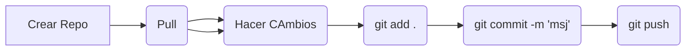

# Despy

Bienvenido a la primer iteracion de la practica de git

```mermaid
graph LR
A[Crear Repo] 
A --> C(Pull) --> D(Hacer CAmbios) --> E(git add .) --> F(git commit -m 'msj') --> g(git push)

C --> D
```
